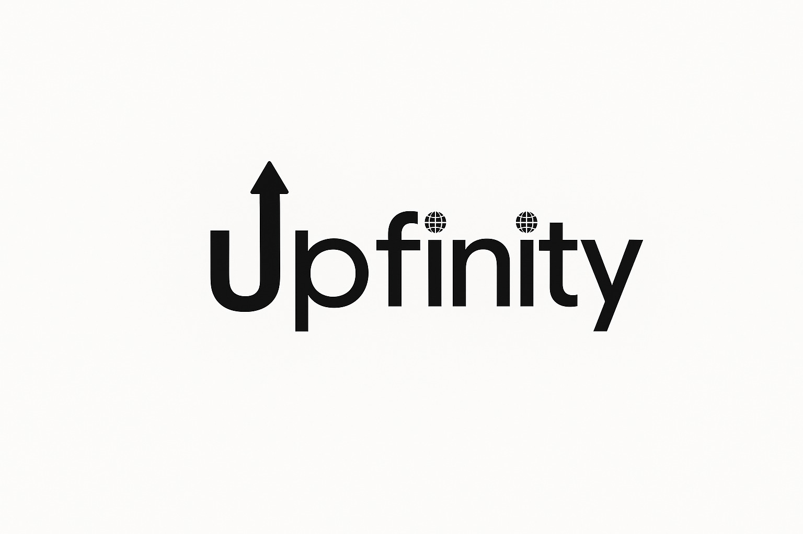

<h3 align="center">
  
</h3>

# Monitoramento Proativo de ATMs
<p align="center">
  Um sistema de <b>monitoramento inteligente de hardware, software e rede de ATMs</b>, com foco em <b>redução de downtime</b>, <b>manutenção preditiva</b> e <b>segurança cibernética</b>.
</p>


<p align="center">
    <a href="mailto:Upfinity_ATM@sptech">
        
    </a> 
     <a href="https://www.bing.com/maps?q=S%C3%A3o+Paulo&satid=id.sid%3Ac6cf2f6e-626c-4267-ae48-9e13ea74d2b9&FORM=KC2MAP&cp=-23.683231%7E-46.595678&lvl=10.7">
        
    </a>
</p>
<p align="left">
    <a href="https://github.com/upfinity-sisa/monitoramento_atm_python">
        
    </a> 
    <a href="https://github.com/upfinity-sisa/monitoramento_atm_java">
        
    </a>
    <a href="https://github.com/upfinity-sisa/monitoramento_atm_web">
        
    </a>
</p>

## 🚨 Problema
- Downtime elevado causado por falhas não previstas.  
- Custos altos de manutenção corretiva emergencial.  
- Ausência de observabilidade e baixa visibilidade sobre o estado real dos equipamentos.  
- Governança de TI fragilizada, com SLAs descumpridos e TCO elevado.  


## 💡 Solução
- Monitoramento contínuo de CPU, memória, disco e rede.  
- Alertas automáticos configuráveis.  
- Dashboard de observabilidade em tempo real.  
- Integração com sistemas de tickets (Jira).  
- Conformidade com PCI-DSS e normas do BACEN.  


## 📊 Caso Real
Falhas em ATMs podem gerar não apenas prejuízos financeiros diretos, mas também **impactar a imagem da instituição financeira**, reduzindo a confiança dos clientes. Estudos indicam que é possível **reduzir downtime em até 30%** e custos de manutenção em **25%** com soluções preditivas.  


## 🗂️ Estrutura da Organização
Este projeto está dividido em múltiplos repositórios:  

- 📂 [monitoramento_atm_bd](../monitoramento_atm_bd) → Banco de Dados  
- 📂 [monitoramento_atm_python](../monitoramento_atm_python) → Agente de Monitoramento (coleta)  
- 📂 [monitoramento_atm_java](../monitoramento_atm_java) → Backend (ETL)  
- 📂 [monitoramento_atm_web](../monitoramento_atm_web) → Interface Web (Dashboard)  
- 📂 [.github](../.github) → Documentação geral e configurações  


## ⚙️ Tecnologias
<div style="display: flex; gap: 10px; flex-wrap: wrap;">
  
  
  
  
  
  
  
</div>


## 🌐 Arquitetura do Sistema
<!-- <p align="center">
  
</p> -->

- 🏧 **ATMs** → origem dos dados (CPU, memória, disco, rede).  
- 🐍 **Agente Python** → coleta de métricas em tempo real e envio para S3.  
- ☕ **ETL em Java** → processamento e transformação dos dados em EC2.  
- 🗄️ **MySQL** → armazenamento centralizado das métricas.  
- 🌐 **Interface Web (JS, HTML, CSS)** → dashboards e relatórios.  
- 📢 **Integrações** → envio de alertas para Jira, Slack e Email.  
- 🤖 **Módulo de Machine Learning (Python/R)** → análises preditivas.  

## Requisitos

### 1. Requisitos do Sistema
Antes de rodar o projeto, certifique-se de que seu ambiente possui:  
- **Java 17** ou superior  
- **MySQL 8** ou superior  
- **Node.js 20** (se usar front-end separado)  
- **IDE**: IntelliJ, VS Code ou outra de sua preferência  

### 2. Requisitos Funcionais Principais
O sistema permite:  
- **RF01:** Cadastrar e gerenciar ATMs  
- **RF02:** Monitorar status de ATMs em tempo real  
- **RF03:** Enviar alertas de indisponibilidade via e-mail ou notificação  
- **RF04:** Visualizar histórico de falhas e uptime dos ATMs  

### 3. Requisitos Não Funcionais
- **RNF01:** Disponibilidade mínima de 99% do sistema  
- **RNF02:** Segurança no acesso, com autenticação e controle de permissões  
- **RNF03:** Escalabilidade para suportar até X ATMs simultâneas  
- **RNF04:** Interface web responsiva e compatível com navegadores modernos  

### 4. Requisitos Adicionais (Opcional)
- Chave de API para serviços de geolocalização (se integrar mapa)  


## 🧩 Como rodar o sistema completo
1. **Clonar os repositórios**  
   ```bash
   git clone https://github.com/ORG/monitoramento_atm_bd.git
   git clone https://github.com/ORG/monitoramento_atm_python.git
   git clone https://github.com/ORG/monitoramento_atm_java.git
   git clone https://github.com/ORG/monitoramento_atm_web.git
## ✒️ Equipe

<table>

<td  align="center"><a  href= "https://github.com/brubrumartins"><br/><b>Bruna Martins</b> </</a><br /> <sub> UX/UI Designer & Front </sub> </br></br> <a  href="https://github.com/brubrumartins" ></a>
</td>

<td  align="center"><a  href= "https://github.com/d1n4ara" ><br/><b>Dandara Ramos</b></</a><br />  <sub> Front & Database Administrator </sub> </br></br> <a  href="https://github.com/d1n4ara" ></a>
</td>

<td  align="center"><a  href="https://github.com/JhoelDiego2" ><br/><b>Jhoel Mita</b></</a><br /> <sub> Fullstack Data Developer </sub> </br></br><a  href="https://github.com/JhoelDiego2" ></a>
</td>
<td  align="center"><a  href="https://github.com/MIGUELLIMA11" ><br/><b>Miguel Sousa</b></</a><br /> <sub> Analista Desenvolvedor Back-end </sub> </br></br><a  href="https://github.com/MIGUELLIMA11" ></a>
</td>
<td  align="center"><a  href="https://github.com/nathanbarbosatx" ><br/><b>Nathan Barbora</b></</a><br /> <sub> Technical Product Owner - Infrastructure/Cloud </sub> </br></br><a  href="https://github.com/nathanbarbosatx" ></a>
</td>
<td  align="center"><a  href="https://github.com/pedrosakaue" ><br/><b>Pedro Sakaue</b></</a><br /> <sub> Product Owner/Developer </sub> </br></br><a  href="https://github.com/pedrosakaue" ></a>
</td>


